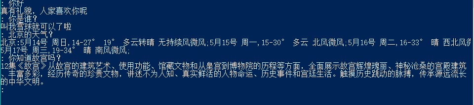

# A Wechat Chatbot

Wechat is the mostly used social medial app in China. It is like a combination of Twitter and Facebook. I have an account opened for my cat, Yuki, and think it would be really cool if 'Yuki' can actually talk.  

[Turing Robot](tuling123.com) is a free chat bot service in Chinese, it helps customers to built official accounts on Wechat and Weibo integrated with chat bot. However, for those who wants use the service on personal purpose, Turing Robot provides people with basic APIs.  

After created your first chat bot on Turing Robot's website, you will get a APIKey for your bot. With your APIKey, you could communicate with your bot using get/post request.

You can find specific introduction about Turing Robot's APIs [here](http://www.tuling123.com/help/h_cent_webapi.jhtml?nav=doc)

## Create chat bot client using Python
```Python
import json
import requests

KEY = 'Your APIKey here'
URL = 'http://www.tuling123.com/openapi/api'

def get_response(req):
    query = {'key': KEY, 'info': req}
    headers = {'Content-type' : 'text/html', 'charset' : 'utf-8'}

    r = requests.get(URL, params = query, headers = headers)
    response = r.text
    print(json.loads(response).get('text').replace('<br>', 'n'))

while True:
    raw = input(": ")
    req = raw.encode('utf-8')
    get_response(req)
```

Save and run the program, you will get something like this:
  

## Link the chat bot to Wechat

Sadly, not liking Turing Robot, Wechat does not provide it's APIs to the public.
Here is a useful tool called [itChat](https://github.com/littlecodersh) created by LittleCoder on GitHub. Wechat has a web version of the app, itChat provides a way for programmers to interact with Wechat by simulating the web requests.

```Python
import itchat
from itchat.content import TEXT
import requests
import threading
import json

bot_api="http://127.0.0.1:8000/get_response"

@itchat.msg_register(TEXT, isFriendChat=True)
def text_reply(msg):
    user_input = msg['Text']
    payload = {"user_input":user_input}
    response = requests.get(bot_api, params=payload).json()["response"]
    itchat.send(response, msg['FromUserName'])

def bot_server():
    from bottle import Bottle, run
    from bottle import response, request
    from json import dumps
    import json
    import requests

    KEY = 'Your APIKey here'
    url = 'http://www.tuling123.com/openapi/api'

    app = Bottle()
    @app.route('/get_response')
    def get_response():
        user_input = request.query.user_input or ""
        query = {'key': KEY, 'info': user_input}
        headers = {'Content-type': 'text/html', 'charset': 'utf-8'}

        r = requests.get(url, params=query, headers=headers)
        # response = r.text
        response = json.loads(r.text).get('text').replace('<br>', 'n')
        res = {'response':response}
        return dumps(res)

    run(app, host='localhost', port=8000)

botThread = threading.Thread(target=bot_server)
botThread.setDaemon(True)
botThread.start()

itchat.auto_login(hotReload=True)
itchat.run()
```
